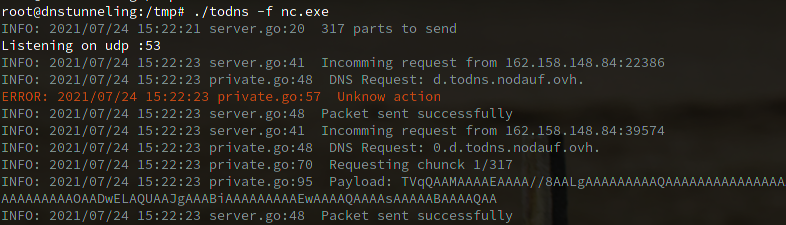
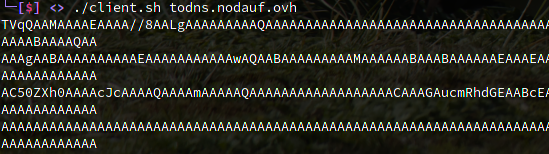

# ToDns

## Description
A simple tool to transfer file over DNS. 
Unlike many others similar tools, no need for more than a command line or a small script for the client side. It is useful on a situation where you cannot even transfer a file.

To download a file, the server will split it in multiple chunks (default max size is 250) and send the corresponding chunk according to the TXT query (\<numericalValue\>.\<domainName\>.\<tld\>).

To be more stealthy the `wait` argument could be adjust to wait a specific time before answering the request. This will delay all the requests as the clients are not multi threading based. The parameter `size` could also be used to send less data for each response.

## Usage

## Server
```
.\todns.go -h
To download a file, the server will split it in multiple chunks (default max size is 250) and send the corresponding chunk according to the TXT query (<numericalValue>.<domainName>.<tld>).

To be more stealthy the "wait" argument could be adjust to wait a specific time before answering the request. This will delay all the requests as the clients are not multi threading based.
The parameter "size" could also be used to send less data for each response.

Usage:
  ToDns [flags]

Flags:
  -f, --file string   File to send
  -h, --help          help for ToDns
  -s, --size int      Size of returned data per request (default 250)
  -v, --verbose       verbose
  -w, --wait int      Wait before sending the response (in ms)
```

## Client
Clients as been writen intto several language in client folder.

## Demo

### Server



### Client


